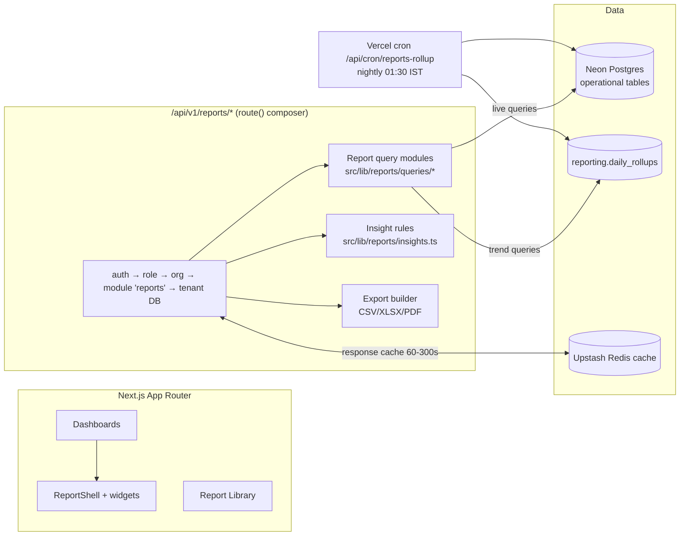
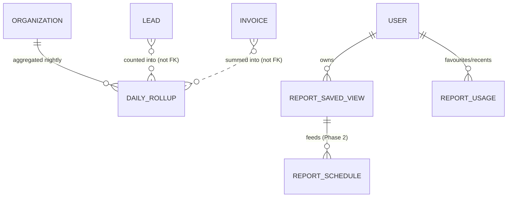
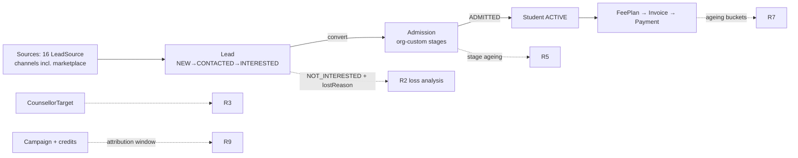

# Vidhyaan CRM — Reports & Analytics Module (Phase 1)
## PRD · Solution Design · UI/UX Spec · Technical Design · API Spec · DB Design · Implementation Guide

> **Status:** Draft for review · **Date:** 2026-07-07 · **Owner:** Product/Architecture
> **Scope anchor:** This document is grounded in the actual Vidhyaan codebase — Prisma models (`Lead`, `Admission`, `AdmissionStage`, `AdmissionCapacity`, `Student`, `Invoice`, `Payment`, `Concession`, `Campaign`, `CampaignRecipient`, `CounsellorTarget`, `Event`, `MessageCreditLedger`), the `route()` composer, the fail-closed `forOrg` tenant client, the academic-year store, and the existing `/api/v1/dashboard/summary` endpoint.

---

# Part 1 — Product Requirements (PRD)

## 1.1 Problem statement

Vidhyaan today has **one** dashboard endpoint (`/api/v1/dashboard/summary`) that answers "what is the state right now" — counts and sums. It cannot answer the questions management actually asks:

| Question asked in real school offices | Can Vidhyaan answer it today? |
|---|---|
| "Which lead source is worth spending on next term?" | No — no source→conversion attribution |
| "Is Counsellor A actually better than Counsellor B, or does she just get better leads?" | No — no per-counsellor conversion/response analytics |
| "Are we on track vs last year's admissions at this point in the cycle?" | No — no time-series, no YoY |
| "Who owes us money, how old is the debt, and is it getting worse?" | Partially — invoice list exists, no ageing/trend |
| "Did the ₹15,000 SMS campaign generate any admissions?" | No — campaign stats stop at delivery |
| "Which grade will hit capacity, which will run empty?" | No — capacity exists in DB, never surfaced |

Schools make three recurring high-stakes decisions: **where to spend marketing money**, **who to chase for fees**, and **whether the admissions team is performing**. Phase 1 exists to make those three decisions fast and evidence-based. Everything else is deferred.

## 1.2 Product principles

1. **Dashboard-first.** The answer appears on login; reports are the drill-down, not the entry point.
2. **Every number is a door.** Every KPI card and chart segment clicks through to the underlying leads/invoices/admissions list, pre-filtered.
3. **Answers, not data.** Each report leads with a computed insight sentence ("Referral leads convert 3.2× better than Google Ads"), not a grid.
4. **Respect the academic-year mental model.** Schools think in AY cycles, not calendar quarters. The global AY switcher (already in `src/stores/academic-year.store.ts`) scopes everything; YoY comparison is a first-class primitive.
5. **No report for the sake of count.** 10 reports in Phase 1. Each maps to a named business decision. Anything that doesn't is cut (see §1.6 "Deliberately excluded").

## 1.3 Personas & decisions they need to make

| Persona | Role enum | Recurring decision | Cadence |
|---|---|---|---|
| School owner / director | `ORG_ADMIN` | Marketing spend allocation, staffing, fee policy | Weekly/Monthly |
| Principal / branch head | `BRANCH_ADMIN` | Branch pipeline health, capacity planning | Weekly |
| Counsellor | `COUNSELLOR` | Which lead to call next; am I on target? | Daily (hourly) |
| Front desk | `RECEPTIONIST` | Today's follow-ups and walk-in load | Daily |
| Accountant | `ACCOUNTANT` | Who to chase, reconciliation, concession control | Daily |
| Learning-centre admin | `ORG_ADMIN` (institution type `LEARNING_CENTER`) | Batch fill rates, course demand | Weekly |
| Platform team | `SUPER_ADMIN` | (Out of Phase 1 org-reporting scope — `/admin` stats already exist; extend in Phase 2) | — |

`TEACHER` and `PARENT` get **no** reporting surface in Phase 1 — no decision of theirs is served by aggregate analytics, and building it would be count-padding.

## 1.4 Success metrics for the module itself

- ≥60% of ORG_ADMIN weekly-active users open Reports at least once/week by week 6 post-launch.
- Counsellor dashboard "My follow-ups due" click-through ≥40% of counsellor sessions.
- P95 dashboard load < 1.2s (cached), < 3s (cold).
- Zero cross-tenant data exposure (tenant-isolation test suite extended to every new endpoint).

## 1.5 Phase 1 scope — one line

**3 role-based dashboards + 10 reports + a reusable filter/save/favourite/export framework + a daily rollup table for trends.** No scheduler, no custom report builder, no PDF designer, no external BI tool.

## 1.6 Deliberately excluded from Phase 1 (with reason)

| Cut | Why |
|---|---|
| Custom report builder (drag-drop fields) | Massive build; school admins won't use it; the 10 curated reports cover >90% of asked questions |
| Scheduled email reports | Valuable but additive — Phase 2 once report engine is stable |
| Marketplace analytics (profile views, enquiry funnels from `SchoolView`) | Distinct audience/funnel; dashboard summary already shows view counts; full report in Phase 2 |
| Attendance/academic-performance reports | No attendance module exists yet — nothing to report on |
| Communication-log analytics | Interesting, not decision-driving in Phase 1 |
| Cross-org benchmarking ("schools like you convert at X%") | Privacy + data-volume prerequisites; Phase 3 |

---

# Part 2 — Dashboard Strategy

Three dashboards. Each exists because a distinct persona logs in with a distinct question.

## 2.1 Executive Dashboard — `/reports` (default for ORG_ADMIN, BRANCH_ADMIN)

**Why it exists:** the owner's Monday-morning question is "are we winning this admission season, and is cash coming in?" One screen, zero clicks.

Layout (desktop, 12-col grid):

```
┌─────────────────────────────────────────────────────────────────┐
│  AY 2026-27 ▾   Branch: All ▾   Compare: vs AY 2025-26 ▾        │
├───────────┬───────────┬───────────┬───────────┬────────────────┤
│ New Leads │ Conversion│ Admissions│ Collected  │ Outstanding    │
│ 342 ▲12%  │ 18.4% ▼2pt│ 63 / 120  │ ₹42.3L ▲8% │ ₹11.2L (31 dd)│
│ vs LY     │ vs LY     │ vs target │ this month │ avg age        │
├───────────┴───────────┴───────────┼───────────┴────────────────┤
│  Admission funnel (this AY vs LY) │  Fee collection trend       │
│  [funnel chart]                   │  [line: billed vs collected]│
├───────────────────────────────────┼─────────────────────────────┤
│  Lead sources by conversion       │  Grade capacity heat        │
│  [horizontal bar, sorted]         │  [bar: admitted/capacity]   │
├───────────────────────────────────┴─────────────────────────────┤
│  ⚠ Attention strip: "27 leads uncontacted >48h · 14 invoices    │
│     overdue >60d · Grade 1 at 96% capacity"                     │
└─────────────────────────────────────────────────────────────────┘
```

The **Attention strip** is the highest-value element: computed exceptions, each a deep link.

## 2.2 Counsellor Dashboard — `/reports/my-desk` (default for COUNSELLOR, RECEPTIONIST)

**Why it exists:** counsellors don't need analytics, they need a **work queue with a scoreboard**. The `CounsellorTarget` model already exists in the schema and is currently underused — this dashboard is where it earns its keep.

Widgets:
1. **Today's follow-ups** (from `Lead.nextFollowUpAt`) — overdue in red, due-today, upcoming. Click → lead drawer.
2. **My month vs target** — leads handled / conversions vs `CounsellorTarget.leadTarget` / `conversionTarget`, progress bars (`indicatorClassName` blue fill).
3. **My response time** — median hours from `Lead.createdAt` → `firstContactedAt`, vs org median (anonymous).
4. **My pipeline** — my leads by status (mini funnel).
5. **Recently gone cold** — my INTERESTED/FOLLOW_UP_PENDING leads with no activity 7+ days.

Data visibility: **own leads only** (`assignedToId = me`). Receptionist variant: unassigned + branch-wide today's follow-ups, no targets widget.

## 2.3 Finance Dashboard — `/reports/finance` (default for ACCOUNTANT)

**Why it exists:** the accountant's day starts with "who pays today and who's slipping." Fee data lives across `Invoice`, `Payment`, `Concession` — this assembles it.

Widgets:
1. **Collection KPIs** — collected MTD, billed MTD, collection rate %, outstanding total, overdue total.
2. **Ageing buckets** — 0-30 / 31-60 / 61-90 / 90+ days, stacked bar, click → defaulters report pre-filtered.
3. **Collection trend** — 12-month line, billed vs collected vs previous year.
4. **Payment-method mix** — donut (`PaymentMethod` groupBy) — informs reconciliation effort.
5. **Concessions granted** — MTD amount + top grantors (control/audit angle).
6. **Today's receipts** — live list of today's `Payment` rows.

## 2.4 Role → landing map

| Role | Default landing | Also can view |
|---|---|---|
| ORG_ADMIN | Executive | All dashboards, all reports, all branches |
| BRANCH_ADMIN | Executive (branch-locked) | All reports scoped to `UserBranchAccess` branches |
| COUNSELLOR | My Desk | Lead/admission reports scoped to own leads |
| RECEPTIONIST | My Desk (branch variant) | Follow-up report (branch) |
| ACCOUNTANT | Finance | All fee reports (org or branch scope), read-only lead counts |
| TEACHER / PARENT | — no access (module hidden) | — |

Enforcement reuses the existing `route()` composer role gate + a new `reports` module license check (same `OrganizationModule` mechanism used by other modules).

---

# Part 3 — The 10 Phase-1 Reports

Grouped by lifecycle. Format per report: decision served, users, KPIs, filters, columns, viz, drill-down, export, future.

### Standard filter/export baseline (applies to all, stated once)
- **Global filters (inherited):** Academic Year (from global store), Branch (from branch access).
- **Export:** CSV + XLSX on every report; PDF only where noted (reuses the existing invoice-PDF infra pattern).
- **Drill-down:** every aggregate row/segment opens the corresponding operational list (leads/admissions/invoices) with filters applied via URL params — no duplicate list UIs built.

---

## R1 · Lead Funnel & Conversion Report

- **Decision served:** "Where in the funnel are we leaking, and is it worse than last year?"
- **Users:** ORG_ADMIN, BRANCH_ADMIN.
- **KPIs:** Total leads, contacted %, interested %, converted %, lost %, median days-to-convert, uncontacted >48h count.
- **Data:** `Lead.status` transitions + `LeadActivity` (type `STATUS_CHANGE`) for stage timing; `firstContactedAt` for response.
- **Filters:** date range (created), source, grade sought, counsellor, priority, branch.
- **Table columns:** Stage · Count · % of previous stage · % of total · Δ vs comparison period · Median days in stage.
- **Viz:** funnel chart with LY ghost overlay; secondary line chart of weekly lead inflow.
- **Drill-down:** funnel segment → lead list filtered to that status.
- **Future:** cohort view (leads created in week X, where are they now), stage-velocity alerts.

## R2 · Lead Source Effectiveness

- **Decision served:** "Which channel deserves next term's marketing budget?" — the single highest-ROI report in the module.
- **Users:** ORG_ADMIN.
- **KPIs per source (`LeadSource` enum — 16 values incl. GOOGLE_ADS, META_ADS, JUSTDIAL, REFERRAL, WALK_IN, VIDHYAAN marketplace):** leads, conversion %, admissions, median days-to-convert, lost-reason top hit.
- **Filters:** date range, branch, grade.
- **Columns:** Source · Leads · Contacted % · Converted · Conv % · Admissions · Median cycle days · Trend sparkline.
- **Viz:** horizontal bar sorted by conversion % with volume as bar labels (guards against "100% conversion of 2 leads" misreads — volume < 10 gets a low-sample badge).
- **Drill-down:** source row → funnel view (R1) filtered to source.
- **Future (Phase 2):** cost-per-source input → true CPA/ROI; UTM ingestion.

## R3 · Counsellor Performance

- **Decision served:** "Who needs coaching, who deserves the bonus, are targets realistic?"
- **Users:** ORG_ADMIN, BRANCH_ADMIN. Counsellors see **their own row only** (in My Desk).
- **KPIs:** leads assigned, contacted %, median first-response hours, conversions, conversion %, target attainment % (`CounsellorTarget`), overdue follow-ups, activities logged.
- **Fairness guard:** show source-mix column — a counsellor fed walk-ins will out-convert one fed Google Ads; the report must not hide that.
- **Filters:** period (defaults to current target period), branch.
- **Viz:** table (primary) + scatter of response-time vs conversion % (coaching quadrants).
- **Drill-down:** counsellor row → their lead list.
- **Future:** activity-quality scoring, auto-rebalancing suggestions.

## R4 · Follow-up Discipline (Operational)

- **Decision served:** "Which promised follow-ups were missed?" — the #1 silent killer of school admissions.
- **Users:** BRANCH_ADMIN, COUNSELLOR (own), RECEPTIONIST (branch).
- **KPIs:** overdue count, due today, completed-on-time % (7d), avg days overdue.
- **Data:** `Lead.nextFollowUpAt` vs `LeadActivity` timestamps.
- **Columns:** Lead code · Parent · Grade · Counsellor · Due date · Days overdue · Last activity · Priority.
- **Viz:** table-first (it's a work list), small trend of on-time %.
- **Drill-down:** row → lead drawer (existing component).
- **Export:** CSV.
- **Future:** WhatsApp nudge to counsellor via existing metered-send.

## R5 · Admission Pipeline & Stage Ageing

- **Decision served:** "Where are applications stuck, and will we fill seats before the season closes?"
- **Users:** ORG_ADMIN, BRANCH_ADMIN.
- **KPIs:** in-progress by stage (`AdmissionStage` is org-customizable — report reads the org's own stage list), median days-in-stage, stuck >14d count, admitted vs `AdmissionCapacity` per grade, document-pending count (`DocumentReviewStatus.PENDING`).
- **Filters:** grade, stage, counsellor, date range.
- **Viz:** stage bar chart with ageing colour bands + **grade capacity heat bar** (admitted/waitlisted/open per grade).
- **Drill-down:** stage → admissions kanban (existing) filtered.
- **Future:** stage-conversion probabilities, seat-forecast.

## R6 · Fee Collection Summary

- **Decision served:** "Is cash flow healthy this month vs plan and vs last year?"
- **Users:** ORG_ADMIN, ACCOUNTANT.
- **KPIs:** billed, collected, collection rate %, refunds, concession amount, net realised; each vs previous period + LY.
- **Data:** `Invoice`, `InvoiceItem`, `Payment` (status SUCCESS), `Concession`; money math via existing pure `src/lib/fees.ts` — **no new fee arithmetic is written for reporting**.
- **Filters:** month/term/AY, branch, grade, fee-plan template, invoice type.
- **Columns (by month or by grade toggle):** Period/Grade · Billed · Collected · Rate % · Concessions · Outstanding.
- **Viz:** combo chart (bars billed, line collected) 12 months; donut payment-method mix.
- **Export:** CSV/XLSX/PDF (management pack page 1).
- **Future:** collection forecast, term-plan variance.

## R7 · Outstanding Fees & Defaulter Ageing

- **Decision served:** "Exactly whom do we chase today, in what order?"
- **Users:** ACCOUNTANT (daily), ORG_ADMIN (weekly).
- **KPIs:** total outstanding, overdue, ageing buckets 0-30/31-60/61-90/90+, defaulter count, % of students with dues.
- **Columns:** Student code · Name · Grade/Section · Guardian phone · Invoice # · Due date · Days overdue · Amount due · Last payment date · Last reminder sent.
- **Filters:** ageing bucket, grade, amount threshold, invoice status.
- **Viz:** stacked ageing bar + table (table is the product here).
- **Drill-down:** row → invoice detail; **bulk action hook:** select rows → "send reminder" via existing org email templates / metered SMS (wired in Phase 1 only as a link to the existing fee-reminder flow, not rebuilt).
- **Export:** CSV/XLSX; PDF "defaulter list" for management meetings.
- **Future:** promise-to-pay tracking, auto-escalation ladders.

## R8 · Concession & Discount Audit

- **Decision served:** "Is discounting under control, and who is granting it?" — revenue-leakage control that owners explicitly ask for.
- **Users:** ORG_ADMIN, ACCOUNTANT.
- **KPIs:** total concession amount, % of billed, count, avg per student, by `ConcessionType`, by grantor.
- **Columns:** Date · Student · Grade · Type · Amount/% · Reason · Granted by · Invoice.
- **Viz:** trend line + by-type donut; table.
- **Export:** CSV/XLSX.
- **Future:** approval-workflow analytics once approvals exist.

## R9 · Campaign Effectiveness

- **Decision served:** "Did that campaign pay for itself?" — closes the loop the credits system opened.
- **Users:** ORG_ADMIN.
- **KPIs per campaign:** recipients, delivered % (`CampaignRecipient` status), credits spent (`MessageCreditLedger` join), leads attributed (leads with source CAMPAIGN/EVENT created within attribution window), conversions from those leads, cost-per-lead in credits.
- **Attribution rule (Phase 1, honest and simple):** time-window + source attribution — leads with `source = CAMPAIGN` created within N days of send, N configurable, default 14. Documented in-UI so users know its limits.
- **Filters:** channel (`CampaignChannel`), date range, status.
- **Viz:** campaign table + channel comparison bars.
- **Drill-down:** campaign → recipient list; attributed leads → lead list.
- **Future (Phase 2):** per-recipient click/UTM attribution, event→admission chains via `EventAnnouncement`.

## R10 · Enrollment Strength & Movement

- **Decision served:** "What is our student base doing — growing, shrinking, where?" Feeds staffing, sections, transport, next-year fee planning.
- **Users:** ORG_ADMIN, BRANCH_ADMIN.
- **KPIs:** active students by grade/section, new admissions this AY, exits by type (`TRANSFERRED`/`DROPPED_OUT`/`ALUMNI`), net movement, YoY grade-wise delta, boy/girl ratio, sibling families count (`SiblingLink`).
- **Learning-centre variant:** by `Course`/batch (`StudentBatch`, `CourseEnrollment`) instead of grade/section — fill rate per batch.
- **Filters:** grade/course, section/batch, status, gender.
- **Viz:** grade-wise population pyramid-style bars with LY overlay; movement waterfall (opening + admits − exits = closing).
- **Export:** CSV/XLSX/PDF.
- **Future:** attrition-risk flags, section-balancing suggestions.

---

# Part 4 — Analytics (computed insights layer)

These are not separate pages — they are **insight generators** surfaced as the Attention strip, insight sentences atop reports, and dashboard callouts. Phase 1 ships rule-based (deterministic SQL) versions; the AI copilot (already scaffolded: `feat(ai)` token mint + JWKS) consumes the same endpoints later.

| Insight | Rule (Phase 1) | Surfaces on |
|---|---|---|
| Uncontacted-lead alert | `firstContactedAt IS NULL AND createdAt < now()-48h` | Exec + My Desk + R1 |
| Funnel-leak detector | Stage conversion this period < 0.8× same period LY | Exec, R1 |
| Source shift | Source share Δ > 10pt vs trailing 90d | R2 |
| Counsellor overload | Assigned open leads > 1.5× team median | R3 |
| Stuck applications | Days-in-stage > 2× org median for that stage | R5 |
| Collection slippage | MTD collection rate < LY same-month − 5pt | Finance, R6 |
| Ageing deterioration | 90+ bucket grew >15% MoM | Finance, R7 |
| Concession spike | MTD concession % of billed > trailing-6-month avg + 3pt | R8 |
| Capacity pressure | Grade at >90% of `AdmissionCapacity` with pipeline still open | Exec, R5 |
| Attrition signal | Exits this term > LY same term | R10 |

Each insight renders as: sentence + severity chip + deep link. Stored transiently (computed on request, cached), **not** persisted — avoids stale-alert debt in Phase 1.

---

# Part 5 — UI / UX Specification

## 5.1 Information architecture

```
/reports                     → role-default dashboard (redirect)
/reports/executive           → Executive Dashboard
/reports/my-desk             → Counsellor/Receptionist Dashboard
/reports/finance             → Finance Dashboard
/reports/library             → Report listing (all reports, search, favourites, recent)
/reports/r/[slug]            → individual report page
/reports/r/[slug]?view=[id]  → saved view applied
```

Sidebar gets one new nav item **Reports** (icon: chart), expanding to Dashboards / Library. Registered following the existing settings-nav single-source pattern.

## 5.2 Report Library page

- Grid of report cards grouped: **Admissions · Finance · Team · Students · Campaigns**.
- Card: title, one-line decision statement ("Decide where to spend marketing budget"), sparkline of headline KPI, ★ favourite toggle, last-viewed timestamp.
- Top strip: **Favourites** row, **Recently viewed** row (from `ReportUsage` table), search box.
- Non-technical-friendly: cards say what question the report answers, never "multi-dimensional analysis".

## 5.3 Report page anatomy (uniform shell — build once)

```
┌──────────────────────────────────────────────────────────────┐
│ ← Library   R2 · Lead Source Effectiveness          ★  ⬇ Export ▾ │
│ "Referral converts 3.2× better than Google Ads this AY."  ⓘ │  ← insight sentence
├──────────────────────────────────────────────────────────────┤
│ [AY chip][Branch chip][Date range][Source ▾][Grade ▾]  Saved views ▾  Reset │
├──────────────┬───────────────────────────────────────────────┤
│ KPI  KPI KPI │            primary visualization              │
├──────────────┴───────────────────────────────────────────────┤
│                        data table (sortable, paginated)      │
└──────────────────────────────────────────────────────────────┘
```

Shared components (all in `src/components/reports/`):
- `ReportShell` — header, insight slot, filter bar, export menu, favourite star.
- `KpiCard` — value in `text-[32px] font-bold tracking-tight text-slate-900 leading-none` (per design system), delta chip (▲ green / ▼ red / neutral), comparison caption in `text-xs text-slate-400`, optional sparkline, whole card clickable.
- `ReportTable` — headers `text-[11px] font-bold uppercase tracking-wider`, body `text-sm leading-relaxed`, sticky header, row click = drill-down.
- Charts — **Recharts** (already the shadcn-ecosystem default), brand primary `#1565D8`, sequential blues for series, semantic red/amber only for negative/warning. Follow dataviz-skill rules at build time.

## 5.4 Filter experience

Four layers (see Part 6): filters render as **chips in a single bar**, never a sidebar tray — school admins found trays intimidating in comparable products. Active non-default filters get a filled chip + one-click ✕. "Reset" restores report defaults. Filter state serialises to URL query (shareable links for free).

## 5.5 States

- **Loading:** skeleton KPI cards + shimmer chart block (no spinners-in-a-void); table skeleton 8 rows.
- **Empty (no data ever):** friendly illustration + "No leads recorded in AY 2026-27 yet" + CTA to the relevant module ("Add your first lead").
- **Empty (filters too narrow):** "No rows match these filters" + "Clear filters" button — distinct from no-data-ever.
- **Error:** inline card "Couldn't load this report" + retry; never blank page. Partial failure on a dashboard degrades per-widget, not whole-page.
- **Low-sample honesty:** any percentage computed on n<10 shows a "low sample" badge.

## 5.6 Responsive

- Dashboards: 12-col → 2-col (tablet) → 1-col stack (mobile), KPI cards first, attention strip pinned top.
- Report tables on mobile: horizontal scroll inside card (`overflow-x-auto`), first column sticky.
- My Desk is the mobile-priority surface (counsellors live on phones): follow-up list is thumb-friendly cards, not a table.

---

# Part 6 — Filter Framework (reusable)

| Layer | Examples | Persistence | Where |
|---|---|---|---|
| **Global** | Academic Year, Branch | Zustand stores (AY store exists; add branch scope to it) | Everywhere; set once, applies to all dashboards/reports |
| **Contextual** | Source, grade, counsellor, stage, ageing bucket, invoice status | URL query params | Per report; defined per-report in a config object |
| **Quick** | Preset chips: "This month", "This AY", "Overdue only", "My leads" | URL | Filter-bar left edge; one tap |
| **Saved views** | Named filter set per user per report ("Grade 1-5, Referral only") | `ReportSavedView` table | Saved-views dropdown; default-view flag |

Implementation: one `ReportFilterConfig` type describing each report's available filters (key, label, type: enum/date-range/entity-picker/number, options source). `ReportShell` renders the bar from config; server validates with the existing zod `parseQuery` helpers in `src/lib/api/query.ts`. **One filter engine, ten configs.**

---

# Part 7 — Technical Design

## 7.1 High-level architecture



Key decisions:

1. **No warehouse, no OLAP engine.** Data volumes per tenant (thousands of leads, not millions) make Postgres + composite tenant indexes sufficient. Region co-location (sin1 ↔ ap-southeast-1) already solved latency.
2. **Hybrid live + rollup.** "Now" numbers (counts, funnel, ageing) query live via `forOrg` tenant client. **Trends and YoY** read a nightly `daily_rollups` fact table — avoids 365-day groupBy scans on every dashboard load and freezes history against soft-deletes/edits.
3. **All report SQL lives in `src/lib/reports/queries/`** as pure functions taking `(db, filters)` — unit-testable, reused by dashboard widgets and full reports (a dashboard widget is a report query with default filters).
4. **Money math** delegates to `src/lib/fees.ts`. No arithmetic duplication.
5. **Insights** are pure functions over query outputs — same testability.

## 7.2 Caching strategy

| Layer | TTL | Key shape | Invalidation |
|---|---|---|---|
| Redis response cache | 120s dashboards / 300s reports | `rpt:{orgId}:{reportKey}:{hash(filters+ay+branch)}` | TTL only (Phase 1 — mutation-driven invalidation is Phase 2 polish) |
| Rollup table | 24h (nightly cron) | date × org × branch × AY grain | Cron rebuilds trailing 3 days each night (late payments/edits self-heal) |
| Client | SWR `stale-while-revalidate`, 60s dedupe | URL | Focus revalidate off for reports (numbers jumping mid-meeting is bad UX) |

Local dev: existing in-memory Redis mock covers this transparently.

## 7.3 Performance

- Every rollup/report query filtered by `orgId` first; new composite indexes listed in §8.
- Rollup cron processes orgs sequentially with per-org transaction; budget < 5 min for 500 orgs (aggregates only).
- Table endpoints paginated (cursor, 50/page) — aggregates and table rows are **separate endpoints** so KPIs render before the grid.
- P95 targets: cached dashboard < 300ms server time; cold report < 1.5s; export ≤ 10k rows synchronous, larger → 413 with "narrow your filters" (async export queue is Phase 2).

## 7.4 Security & multi-tenancy

- Every endpoint through `route()` composer: session → role gate → org cache → **module license `reports`** → read-only guard → `forOrg(orgId)` tenant client. Fail-closed as everywhere else.
- Rollup table rows carry `org_id`; cron writes with explicit org scoping; tenant-isolation vitest suite extended with reporting tables + one cross-tenant probe per new endpoint.
- Row-level scoping by role applied **inside query modules** (single choke point): COUNSELLOR → `assignedToId = userId`; BRANCH_ADMIN → branch ids from `UserBranchAccess`; ACCOUNTANT → fee queries full-org (or branch), lead queries aggregate-only.
- Exports respect the same scoping (export = same query, different serialiser — no separate path to leak through).
- Defaulter/phone-bearing exports logged to `AuditLog` (`action: EXPORT`) — schools handle minors' guardian data.

## 7.5 Export framework

- `src/lib/reports/export.ts`: takes report key + filters + format → streams file.
- CSV: hand-rolled streaming (no dep). XLSX: `exceljs`. PDF: existing invoice-PDF stack (React-PDF pattern) with a generic report template (title, filters applied, KPI row, table).
- Filename convention: `vidhyaan_{report}_{org-short}_{yyyymmdd}.{ext}`; filters echoed in header rows (auditability of "what was this list?").

---

# Part 8 — Database Design (additive only)

New Postgres schema `reporting`. **Zero operational-data duplication** — only aggregates, preferences, and usage metadata.

```prisma
/// Nightly per-day aggregates. One row per org×branch×AY×date×metric grain.
model DailyRollup {
  id             String   @id @default(cuid())
  orgId          String   @map("org_id")
  branchId       String?  @map("branch_id")
  academicYearId String?  @map("academic_year_id")
  date           DateTime @db.Date
  metric         String   // 'leads_created' | 'leads_converted' | 'leads_contacted'
                          // | 'admissions_started' | 'admissions_admitted'
                          // | 'invoiced_amount' | 'collected_amount' | 'concession_amount'
                          // | 'students_active' | 'students_exited' | 'campaign_credits_spent'
  dimension      String?  // optional sub-grain: source / grade / stage / counsellorId / paymentMethod
  dimensionValue String?  @map("dimension_value")
  count          Int      @default(0)
  amount         Decimal? @db.Decimal(12, 2)

  @@unique([orgId, branchId, academicYearId, date, metric, dimension, dimensionValue])
  @@index([orgId, metric, date])
  @@index([orgId, academicYearId, metric])
  @@map("daily_rollups")
  @@schema("reporting")
}

/// Named filter set a user saved on a report.
model ReportSavedView {
  id        String   @id @default(cuid())
  orgId     String   @map("org_id")
  userId    String   @map("user_id")
  reportKey String   @map("report_key")   // 'lead-source-effectiveness', ...
  name      String
  filters   Json                          // validated against ReportFilterConfig on read AND write
  isDefault Boolean  @default(false) @map("is_default")
  createdAt DateTime @default(now()) @map("created_at")
  updatedAt DateTime @updatedAt @map("updated_at")

  @@unique([userId, reportKey, name])
  @@index([orgId, userId])
  @@map("report_saved_views")
  @@schema("reporting")
}

/// Favourite + recency in one table (one row per user per report).
model ReportUsage {
  id           String    @id @default(cuid())
  orgId        String    @map("org_id")
  userId       String    @map("user_id")
  reportKey    String    @map("report_key")
  isFavourite  Boolean   @default(false) @map("is_favourite")
  lastViewedAt DateTime? @map("last_viewed_at")
  viewCount    Int       @default(0) @map("view_count")

  @@unique([userId, reportKey])
  @@index([orgId, userId, lastViewedAt])
  @@map("report_usage")
  @@schema("reporting")
}

/// Phase 2 placeholder — scheduled report delivery. Migration written now, feature later.
model ReportSchedule {
  id         String   @id @default(cuid())
  orgId      String   @map("org_id")
  userId     String   @map("user_id")
  reportKey  String   @map("report_key")
  savedViewId String? @map("saved_view_id")
  cron       String   // 'weekly_mon_08' style token, not raw cron, validated set
  channel    String   // 'email'
  recipients Json
  enabled    Boolean  @default(false)
  createdAt  DateTime @default(now()) @map("created_at")

  @@index([orgId, enabled])
  @@map("report_schedules")
  @@schema("reporting")
}
```

Supporting index additions on **existing** tables (verify before adding — several exist already):
- `leads(org_id, source, status)` — R2 groupBy.
- `leads(org_id, next_follow_up_at)` partial `WHERE deleted_at IS NULL AND status NOT IN ('CONVERTED','NOT_INTERESTED')` — R4/My Desk hot path.
- `invoices(org_id, status, due_date)` — R7 ageing.
- `payments(org_id, status, paid_at)` — R6/Finance MTD.
- `admissions(org_id, stage_id, updated_at)` — R5 ageing.

## 8.1 Rollup ER context



(Dotted = aggregation lineage, deliberately no foreign keys into operational tables — rollups must survive soft-deletes.)

---

# Part 9 — API Specification

All under `/api/v1/reports`, all via `route()` composer (auth → role → module `reports` → tenant). Query params validated with `parseQuery` zod helpers. Errors: standard central ZodError → 422.

### Dashboards
```
GET /api/v1/reports/dashboards/executive
    ?branchId&compare=ly|none            → { kpis[], funnel, feeTrend[], sources[], capacity[], attention[] }
GET /api/v1/reports/dashboards/my-desk   → { followups{overdue,today,upcoming}, targets, responseTime, pipeline, goneCold[] }
GET /api/v1/reports/dashboards/finance
    ?branchId                            → { kpis[], ageing[], trend[], methodMix[], concessions, todaysReceipts[] }
```
Single endpoint per dashboard (one round-trip, widgets destructure), each widget block independently nullable for graceful degradation.

### Reports (uniform pattern)
```
GET /api/v1/reports/r/{reportKey}/summary?<filters>   → { kpis[], insight, charts{} }
GET /api/v1/reports/r/{reportKey}/rows?<filters>&cursor&limit&sort → { rows[], nextCursor }
GET /api/v1/reports/r/{reportKey}/export?<filters>&format=csv|xlsx|pdf → file stream (audit-logged)
GET /api/v1/reports/meta                              → [{ key, title, decision, category, filters: FilterConfig, allowedRoles }]
```
`reportKey` ∈ the 10 slugs; `meta` drives the Library page and filter bars — frontend has zero hard-coded filter definitions.

### Saved views / favourites / recents
```
GET    /api/v1/reports/views?reportKey=            → saved views (own)
POST   /api/v1/reports/views                       { reportKey, name, filters, isDefault }
PATCH  /api/v1/reports/views/{id}
DELETE /api/v1/reports/views/{id}
PUT    /api/v1/reports/usage/{reportKey}           { favourite? }   // also bumps lastViewedAt on report open
GET    /api/v1/reports/usage                       → { favourites[], recent[] }
```

### Cron
```
POST /api/cron/reports-rollup      (Vercel cron, secret-guarded like existing crons)
     ?date=YYYY-MM-DD&orgId=       // optional backfill params
```

---

# Part 10 — Implementation Plan

Estimates assume current velocity (single dev + Claude). Total Phase 1: **~4 sprints (8 weeks)**.

## Sprint 1 — Foundation: data layer + engine (Weeks 1-2)

- **Objectives:** rollup pipeline, query-module pattern, API skeleton.
- **DB:** migration for `reporting` schema (4 tables) + verified index additions; `npx prisma migrate deploy`.
- **Backend:** `src/lib/reports/` (types, `ReportFilterConfig`, registry); query modules for leads + fees rollups; `/api/cron/reports-rollup` + Vercel cron entry; backfill script for current + previous AY; `route()` module gate for `reports` (seed `Module` row, attach to plans); `meta`, `views`, `usage` endpoints.
- **Testing:** rollup correctness vitest (fixture org: known leads/payments → expected rollup rows); tenant-isolation extension; idempotent cron re-run test (3-day self-heal window).
- **Acceptance:** cron populates rollups for a seeded org across 2 AYs; re-run produces identical rows; cross-tenant probes fail closed.

## Sprint 2 — Dashboards (Weeks 3-4)

- **Objectives:** three dashboards live; this is the visible-value milestone.
- **Backend:** three dashboard endpoints; insight rules v1 (attention strip: uncontacted, overdue invoices, capacity pressure, stuck applications); Redis response caching.
- **Frontend:** `/reports` routes + nav; `KpiCard`, `AttentionStrip`, chart wrappers (Recharts per dataviz rules); Executive, My Desk, Finance pages; loading skeletons, per-widget error degradation; role-based landing redirect.
- **Testing:** insight-rule unit tests (each rule: fires/doesn't-fire fixtures); role visibility tests (COUNSELLOR gets own-leads-only numbers).
- **Performance gate:** cached exec dashboard < 300ms server; verified via `npm run build` + prod-like check.
- **Acceptance:** each of ORG_ADMIN / COUNSELLOR / ACCOUNTANT logs in → lands on correct dashboard → every KPI clicks through to a correctly-filtered operational list.

## Sprint 3 — Report engine + first 5 reports (Weeks 5-6)

- **Objectives:** `ReportShell` once, then reports become config + query.
- **Frontend:** `ReportShell`, filter bar from config, `ReportTable`, saved-views UI, Library page (cards, favourites, recents, search), URL-serialised filters, empty/error/low-sample states.
- **Backend + reports:** R1 Funnel, R2 Source Effectiveness, R4 Follow-up Discipline, R6 Fee Collection, R7 Defaulter Ageing (the five daily-use reports). Summary + rows + insight per report.
- **Export:** CSV + XLSX for these five; export audit logging.
- **Testing:** query-module unit tests per report (fixtures → expected aggregates), zod filter validation tests, export snapshot tests.
- **Acceptance:** accountant can produce the defaulter list with ageing filter and export XLSX in <3 clicks from login.

## Sprint 4 — Remaining reports + polish + PDF (Weeks 7-8)

- **Objectives:** complete the 10, harden, ship.
- **Reports:** R3 Counsellor Performance (with fairness source-mix), R5 Admission Pipeline + capacity heat, R8 Concession Audit, R9 Campaign Effectiveness (attribution window), R10 Enrollment Strength (incl. learning-centre course/batch variant).
- **Export:** PDF for R6/R7/R10 (management pack pattern).
- **Polish:** mobile pass (My Desk cards, sticky first column), YoY compare toggle on Exec, saved-view default application, `verify_project.py` run, docs update (CLAUDE.md capability map + work log).
- **Testing:** full tenant-isolation suite, `npm run build`, `npm test`, load sanity on largest real org, drill-down link audit (every KPI/segment → correct filtered list).
- **Acceptance criteria (module-level):** 10/10 reports pass fixture tests; P95 targets met; zero isolation failures; module license gate verified (org without `reports` module sees upsell, not data).

## Rollout

Feature-flag via `OrganizationModule` — enable for 2-3 pilot schools first, watch Redis hit rates + query times, then attach `reports` to plans (natural upsell lever for Billing).

---

# Part 11 — Future Roadmap

### Phase 1 (this document)
3 dashboards · 10 reports · filter/saved-view/favourite/recent framework · CSV/XLSX/PDF export · nightly rollups · rule-based insights · module licensing.

### Phase 2 (next quarter)
- **Scheduled reports** (`ReportSchedule` table already migrated): weekly Exec pack + defaulter list to email via existing org-template mail infra.
- **Marketplace analytics report:** `SchoolView` / `ParentEnquiry` funnel — profile views → enquiries → leads (Vidhyaan-source ROI proof, also a platform sales asset).
- **Campaign cost & true ROI:** cost input per source/campaign → CPA, revenue attribution to fees collected.
- **Mutation-driven cache invalidation**, async large exports.
- **Platform-admin analytics** (`/admin`): cross-org adoption, credit consumption, plan conversion.
- **Bulk actions from reports:** defaulter list → send reminders inline via metered-send.

### Phase 3 (6-12 months)
- **AI copilot integration:** natural-language questions over report endpoints ("compare Grade 1 admissions with last year") — the JWKS/token foundation from the current AI work is the auth path; report query modules become the copilot's tool layer.
- **Forecasting:** admission-season projection, fee-collection forecast, attrition-risk scoring.
- **Anonymous cross-org benchmarking** (opt-in): conversion/collection percentile vs similar institutions — a genuine premium differentiator.
- **Custom report builder** — only if pilot data shows curated reports leave real questions unanswered; otherwise permanently skip.

---

## Appendix A — Report → decision → persona matrix

| # | Report | Decision | Primary persona | Cadence |
|---|--------|----------|-----------------|---------|
| R1 | Lead Funnel & Conversion | Fix funnel leaks | Owner/Principal | Weekly |
| R2 | Lead Source Effectiveness | Allocate marketing budget | Owner | Monthly |
| R3 | Counsellor Performance | Coach/reward team | Owner/Principal | Monthly |
| R4 | Follow-up Discipline | Rescue slipping leads today | Counsellor/Branch | Daily |
| R5 | Admission Pipeline & Ageing | Unstick applications, fill seats | Principal | Weekly |
| R6 | Fee Collection Summary | Cash-flow health check | Owner/Accountant | Monthly |
| R7 | Defaulter Ageing | Today's collection chase list | Accountant | Daily |
| R8 | Concession Audit | Control revenue leakage | Owner | Monthly |
| R9 | Campaign Effectiveness | Repeat or kill campaigns | Owner | Per campaign |
| R10 | Enrollment Strength | Staffing/sections/next-year planning | Owner/Principal | Termly |

## Appendix B — Admission-season flow the module observes


